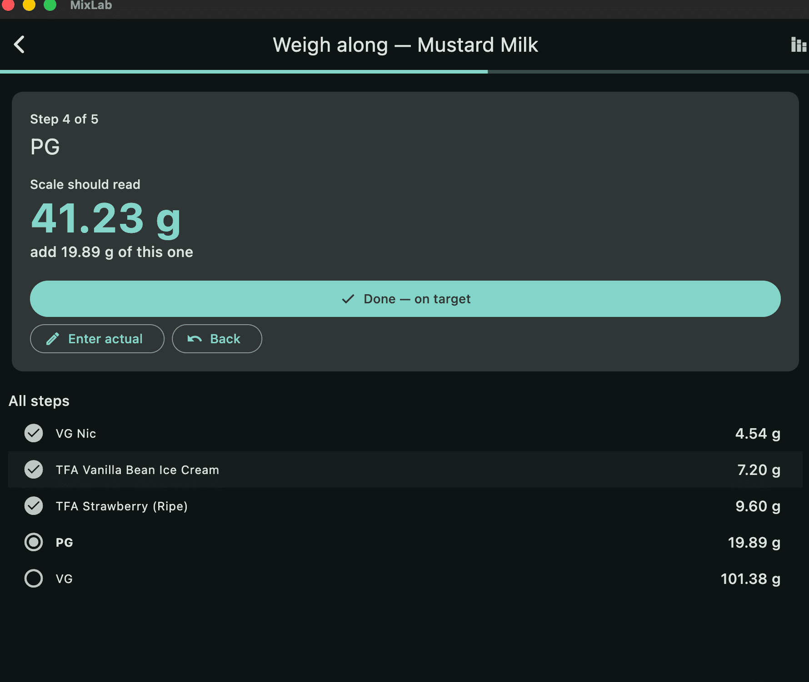
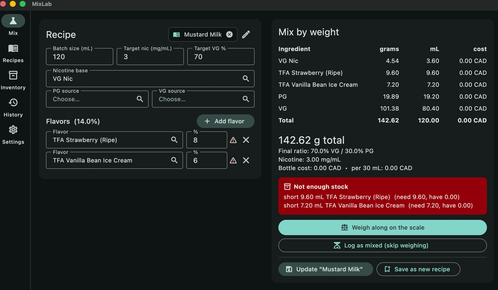
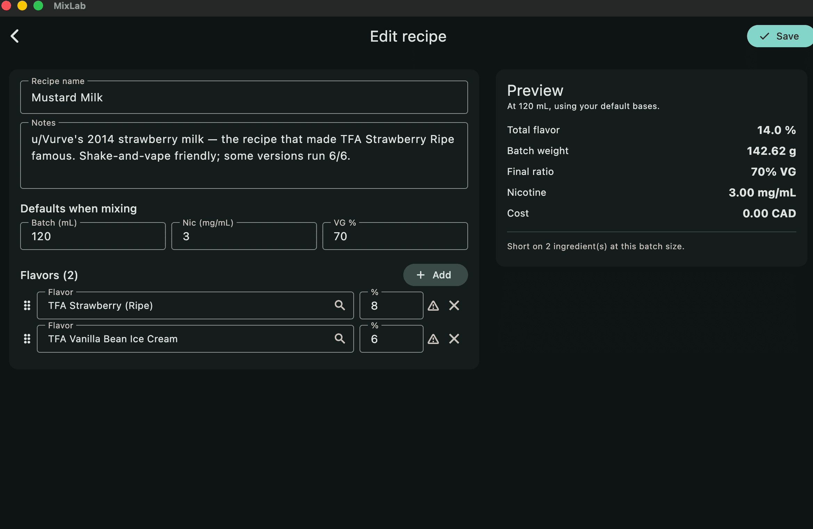
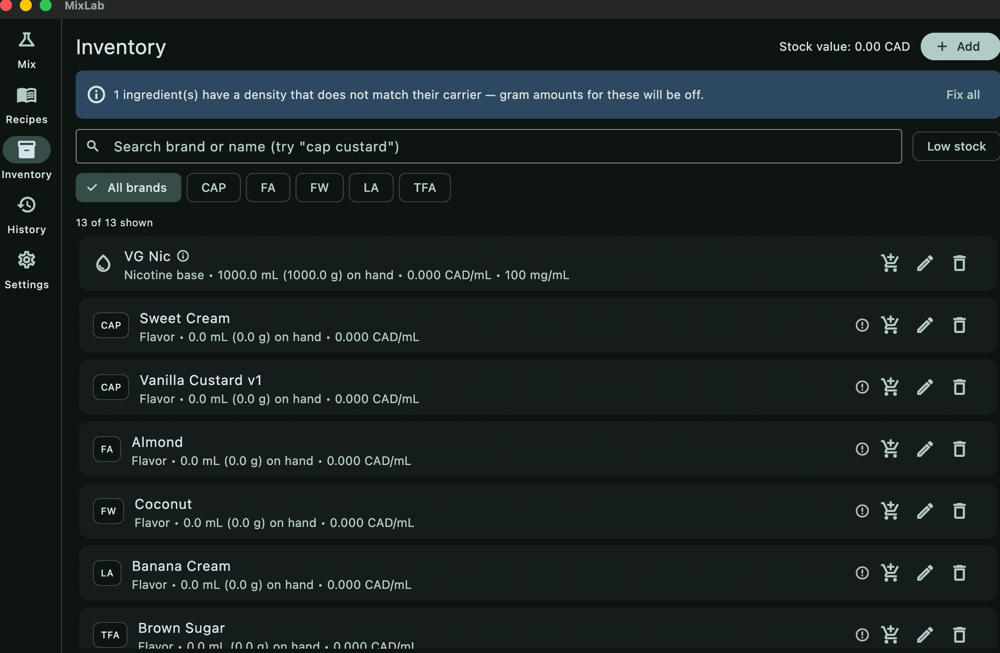
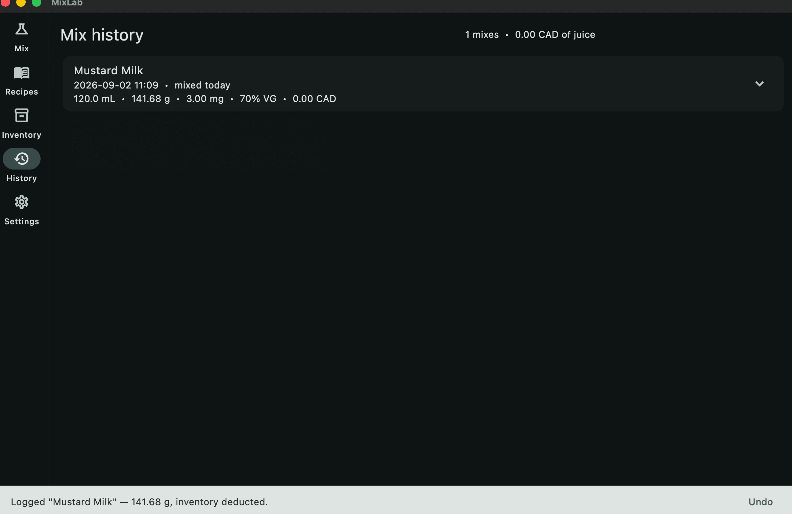

# MixLab
[](https://github.com/JettScythe/mixlab/actions)
A weight-first e-liquid calculator with inventory, cost tracking, and a
guided weigh-along mode. Cross-platform desktop and mobile, built with
Flutter. All data stays on your machine.

Status: `v0.1.0-beta.1` — usable, but the schema is young and the builds
are unsigned. Export a backup before upgrading.

## Why another one

Most e-liquid calculators are volume-first tools with weights bolted on:
they compute mL, then multiply by a density constant at the end. That
falls apart in two places. A 100 mg/mL nicotine base in VG is roughly
1.26 g/mL, not the 1.036 a PG assumption gives you — a ~20% weight error
on the single most safety-relevant ingredient. And once you overpour a
flavor by 0.05 g, every downstream number in a static table is wrong,
with nothing telling you so.

MixLab treats the scale as the source of truth. Densities follow each
ingredient's actual carrier, the weigh-along mode shows cumulative
targets that shift when you overpour, and the mix log records what you
actually weighed rather than what was planned.


## Comparison

Rough positioning first:

| Tool | Form | Cost | Best at |
| --- | --- | --- | --- |
| MixLab | Native desktop + mobile | Free, open source | Weight-first mixing, local stash and cost tracking |
| eJuice Me Up | Windows desktop | Free | The classic; simple, offline, no longer maintained |
| e-liquid-recipes.com | Web | Free with paid tier | Huge shared recipe database and community |
| AllTheFlavors | Web | Free | Recipe discovery and flavor notes |
| Steam Engine | Web | Free | Precise calculation, coil and wicking tools |
| Spreadsheet | Whatever you build | Free | Total control, zero guardrails |

### Mixing

| Capability | MixLab | eJuice Me Up | ELR | ATF | Steam Engine |
| --- | --- | --- | --- | --- | --- |
| Weight output in grams | Yes | Yes | Yes | Yes | Yes |
| Per-ingredient density | Yes | Partial | Yes | Partial | Yes |
| Carrier-aware density (VG nic base, VG-carried flavors) | Yes | No | Partial | No | Partial |
| Achieved PG/VG shown vs target | Yes | No | Partial | No | Yes |
| Achieved nicotine recalculated after weighing | Yes | No | No | No | No |
| Batch volume preserved when concentrates overrun the ratio | Yes | No | Varies | Varies | Varies |
| Percent by weight instead of volume | Yes | No | Yes | No | Yes |
| Max-VG mode | No | Yes | Yes | Yes | Yes |
| Nicotine salts and mg/g bases | No | No | Yes | Partial | Yes |
| Additives excluded from flavor percentage | Yes | No | Yes | Yes | No |

### At the scale

| Capability | MixLab | eJuice Me Up | ELR | ATF | Steam Engine |
| --- | --- | --- | --- | --- | --- |
| Step-by-step weigh-along | Yes | No | No | No | No |
| Cumulative targets that adjust after an overpour | Yes | No | No | No | No |
| Scale resolution awareness with warnings | Yes | No | No | No | No |
| Screen kept awake while mixing | Yes | n/a | No | No | No |
| Logs real weighed amounts, not planned ones | Yes | No | No | No | No |

### Inventory and cost

| Capability | MixLab | eJuice Me Up | ELR | ATF | Steam Engine |
| --- | --- | --- | --- | --- | --- |
| Ingredient stash with stock levels | Yes | Partial | Yes | Yes | No |
| Automatic deduction when a mix is logged | Yes | No | Yes | No | No |
| Exact undo restoring the amounts deducted | Yes | No | No | No | No |
| Cost per bottle and per reference volume | Yes | Yes | Yes | No | No |
| Restock log with weighted-average cost basis | Yes | No | No | No | No |
| Low-stock flags and filter | Yes | No | Yes | No | No |
| Shortfall check before you start mixing | Yes | No | Partial | No | No |
| Bottle, cap and shipping costs | No | No | Partial | No | No |

### Recipes and history

| Capability | MixLab | eJuice Me Up | ELR | ATF | Steam Engine |
| --- | --- | --- | --- | --- | --- |
| Save and reload recipes | Yes | Yes | Yes | Yes | No |
| Seeded with DIY classics | Yes | No | n/a | n/a | No |
| Shared public recipe database | No | No | Yes | Yes | No |
| Import from ELR or AllTheFlavors | No | No | n/a | n/a | No |
| Edit a saved recipe in place | Yes | Yes | Yes | Yes | n/a |
| Mix history with steep dates | Yes | No | Partial | No | No |
| Tasting notes and ratings | Yes | No | Yes | Yes | No |

### Platform and data

| Capability | MixLab | eJuice Me Up | ELR | ATF | Steam Engine |
| --- | --- | --- | --- | --- | --- |
| macOS | Yes | No | Browser | Browser | Browser |
| Windows | Yes | Yes | Browser | Browser | Browser |
| Linux | Yes | Wine | Browser | Browser | Browser |
| iOS and Android | Yes | No | Browser | Browser | Browser |
| Works fully offline | Yes | Yes | No | No | No |
| No account required | Yes | Yes | No | No | Yes |
| Data stored locally only | Yes | Yes | No | No | n/a |
| Full JSON export and import | Yes | Partial | Partial | Partial | n/a |
| Versioned schema with migrations | Yes | No | n/a | n/a | n/a |
| Open source | Yes | No | No | No | No |

Where MixLab loses: no recipe community, no in-place recipe editing, no
by-weight percentages, no salts or additive handling. If you mix from
shared recipes and want a library to browse, ELR remains the better tool
and the two work fine together — build there, mix here.

## Features in detail

- Weight-first calculation with per-ingredient density derived from kind
  and carrier VG percentage
- Inventory with brand-aware search, stock levels, low-stock filtering
  and duplicate prevention
- Cost per mL, per bottle and per reference volume, with a
  weighted-average basis that updates on restock
- Pre-mix feasibility check listing exact shortfalls
- Weigh-along mode with cumulative targets, tare toggle, back-stepping
  and a commit step that logs real weights
- Mix history with steep-day counts, achieved nicotine and VG%, and
  exact undo that restores what was deducted
- Restock log with undo restoring the previous stock and cost basis
- JSON export and import, merged by id so re-importing is safe
- Recovery screen if stored data ever fails to load, with a raw-data
  dump so nothing is lost


## Screenshots

| Calculator | Recipe editor |
| --- | --- |
|  |  |

| Inventory | Mix history |
| --- | --- |
|  |  |
## Install

Download from [Releases](../../releases). Builds are unsigned, so each
platform will complain once.

macOS: extract, then double-click `mixlab.app`. macOS will block it
because the build is unsigned — open **System Settings → Privacy &
Security**, scroll to the message about mixlab, and click **Open
Anyway**. You only need to do this once.

```bash
tar -xzf mixlab-macos.tar.gz
open mixlab.app
```

On older macOS versions the block is a dead end with no override. In
that case, clear the quarantine flag manually:

```bash
xattr -dr com.apple.quarantine mixlab.app
```
Windows: unzip, run `mixlab.exe`. SmartScreen shows a warning —
"More info" then "Run anyway". Keep the whole folder together; the exe
needs its sibling DLLs and `data/`.

Linux:

```bash
tar -xzf mixlab-linux.tar.gz
./bundle/mixlab
```

## Build from source

Requires the Flutter SDK on the stable channel.

```bash
git clone https://github.com/jettscythe/mixlab.git
cd mixlab
flutter pub get
flutter run -d macos    # or windows, linux, chrome, or a device id
```

Platform toolchains: Xcode for macOS, Visual Studio 2022 with the
Desktop C++ workload for Windows, and on Debian-based Linux:

```bash
sudo apt-get install -y clang cmake ninja-build pkg-config \
  libgtk-3-dev liblzma-dev libstdc++-12-dev
```

Desktop apps cannot be cross-compiled — each target builds on its own OS.
CI covers all three.

```bash
flutter test
flutter analyze
dart format .
```

## Your data

Stored locally via `shared_preferences`, in the OS-standard location for
each platform. No network calls, no telemetry, no account.

Export from Settings before upgrading between betas. Import merges by
id, so restoring the same file twice is harmless.

The schema is versioned with forward migrations. Loading data from a
newer build than the one you are running will refuse rather than
corrupt.

## Roadmap 

Planned work and known gaps: [ROADMAP.md](ROADMAP.md).

## Safety

Nicotine concentrate is genuinely hazardous. Wear nitrile gloves and eye
protection, work in a ventilated space, and store it away from children
and pets. This software is a calculator, not a safety device — verify
its output before you mix anything you intend to inhale.


## License

MIT. See [LICENSE](LICENSE).

